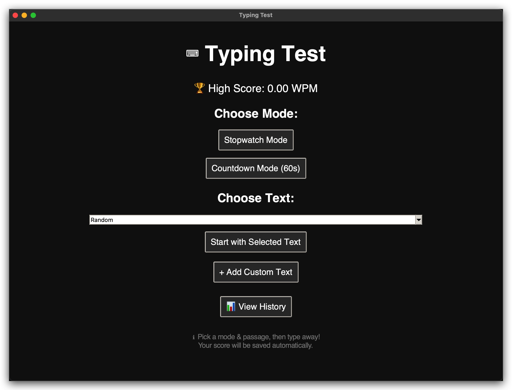
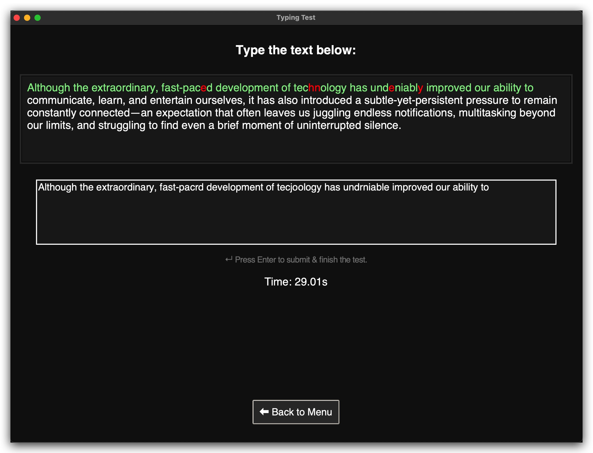
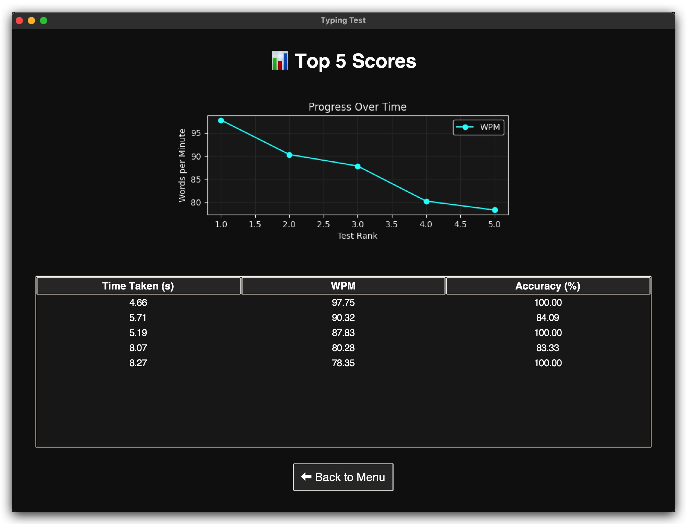

# ⌨️ Typing Test (Tkinter + Matplotlib)

A sleek **typing speed test application** built with **Python, Tkinter, and Matplotlib**, featuring dark mode, real-time accuracy highlighting, multiple modes, score history tracking, and a visual progress chart.  

 <!-- Replace with your actual screenshot -->

---

## ✨ Features

- 🕑 **Two Modes**: Stopwatch mode & Countdown mode (60s)  
- 📝 **Custom Texts**: Add your own passages or load from `sentences.txt` & `long_texts.txt`  
- 🎯 **Real-time Feedback**: Characters turn **green** (correct) or **red** (incorrect) while typing  
- 🏆 **Score Tracking**: Saves your top 5 results (WPM, accuracy, and time)  
- 📊 **Progress Visualization**: View performance history with charts and tables  
- 🌙 **Dark Mode UI**: Clean, modern design using `ttk` styling  

---

## 🛠️ Installation

1. **Clone this repository**
   ```bash
   git clone https://github.com/Blues1998/TypingTest1.git
   cd TypingTest1
   ```

2. **Create & activate a virtual environment** (optional but recommended)
   ```bash
   python3 -m venv .venv
   source .venv/bin/activate   # macOS/Linux
   .venv\Scripts\activate      # Windows
   ```

3. **Install dependencies**
   ```bash
   pip install -r requirements.txt
   ```

---

## 📦 Requirements

- Python 3.8+
- Tkinter (bundled with Python)
- Matplotlib  

`requirements.txt` should look like:
```
matplotlib
```

---

## 🚀 Usage

Run the app with:

```bash
python main.py
```

### Available Modes:
- **Stopwatch Mode** → Type until you press Enter  
- **Countdown Mode (60s)** → Type as much as possible within one minute  

### Data Files:
- `sentences.txt` → List of short sentences for typing practice  
- `long_texts.txt` → Longer passages for countdown mode  
- `scores.csv` → Stores your top 5 scores automatically  

---

## 📊 Example Results

| Time Taken (s) | WPM  | Accuracy (%) |
|----------------|------|--------------|
| 45.21          | 72.5 | 94.8%        |
| 60.00          | 68.9 | 91.3%        |

---

## 🖼 Screenshots

Main Menu:  
  

Typing Screen:  
  

History & Progress Chart:  
  

---

## 🤝 Contributing

Contributions, issues, and feature requests are welcome!  
Feel free to fork this repo and open a pull request.  

---

## 📜 License

This project is licensed under the **MIT License** – you’re free to use, modify, and share, but please give credit.  

---

### ⭐ If you like this project, give it a star on GitHub!
