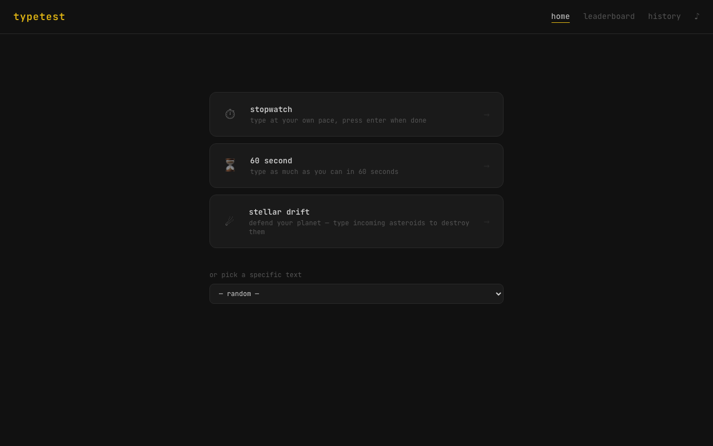
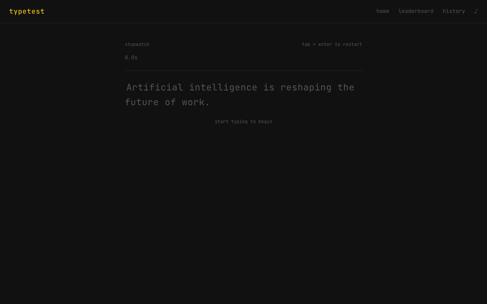
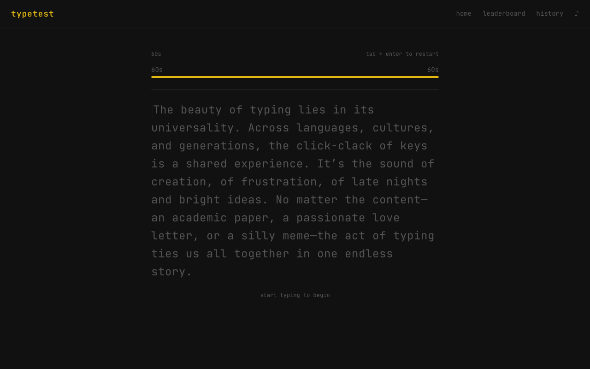
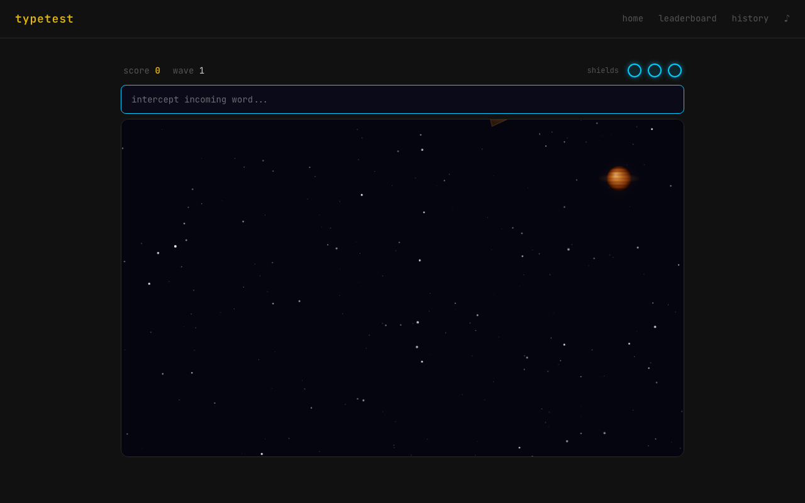
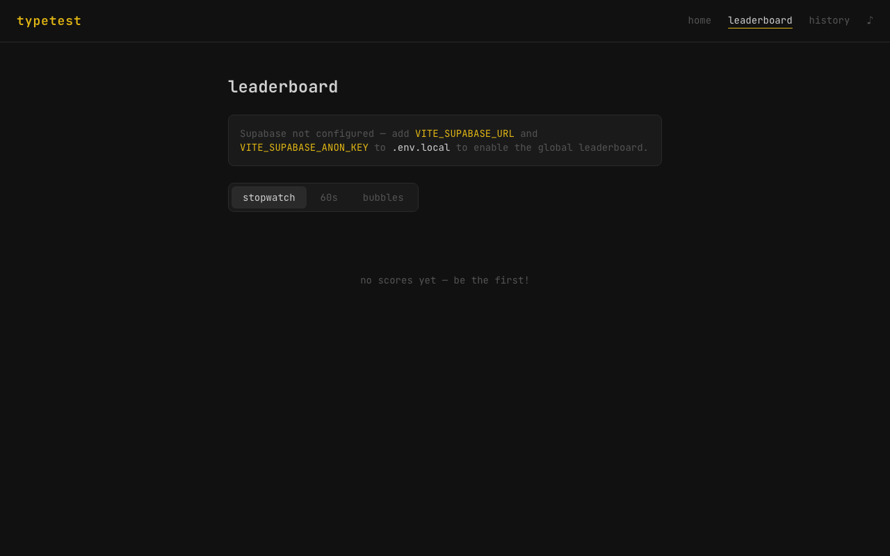
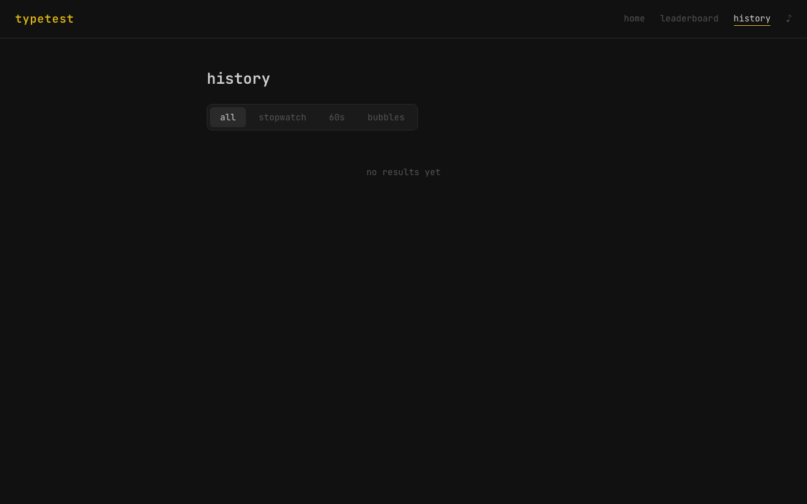

# typetest

A fast, minimal typing test app with multiple game modes, persistent stats, and a clean dark UI.

**Live:** [blues1998.github.io/TypingTest1](https://blues1998.github.io/TypingTest1/)



---

## Modes

### Typing
| Mode | Description |
|------|-------------|
| **Stopwatch** | Type at your own pace, press Enter when done |
| **Countdown** | Type as much as possible before time runs out (15 / 30 / 60 / 120s) |
| **Word count** | Race through an exact number of words (10 / 25 / 50 / 100) |
| **Quotes** | Famous quotes from literature and history |
| **Code snippets** | Real code — brackets, indentation and all |
| **Daily challenge** | Same passage for everyone, resets at midnight |

### Challenge
| Mode | Description |
|------|-------------|
| **Ghost race** | Browse your recorded runs and race against your previous best on the same text |
| **Stellar Drift** | Asteroids fall from above — type the word on each to destroy it before they reach the planet |
| **Survival** | Type words to add time; run out and it's over |

---

## Features

- **Per-key accuracy heatmap** — see your weakest keys across all sessions
- **Persistent stats** — WPM history, accuracy trends, average over 7 / 30 / 90 days / all-time
- **Ghost replay** — every stopwatch run records a replay; the ghost race lobby lets you pick a saved text and race your past self
- **Achievements** — 26 badges across 4 tiers (Bronze → Diamond)
- **Daily streak** — tracks consecutive days of practice
- **Customisation** — caret style (line / block / underline), font (JetBrains Mono / Fira Code / system), dark/light theme
- **Language packs** — English, Spanish, French, German
- **Text modifiers** — inject numbers and punctuation into passages
- **Online leaderboard** — powered by Supabase



---

## Tech stack

- **React 19** + **Vite 8**
- **Tailwind CSS v4** with CSS custom properties for theming
- **Framer Motion** for page transitions and animations
- **Recharts** for WPM history graphs
- **Supabase** for leaderboard persistence
- **Vitest** + **@testing-library/react** — 236 tests

---

## Getting started

```bash
# Install dependencies
npm install

# Start dev server
npm run dev

# Run tests
npm test

# Production build
npm run build
```

### Leaderboard (optional)

The leaderboard requires a Supabase project. Copy `.env.local.example` to `.env.local` and fill in your project URL and anon key. The app works fully without it — the leaderboard page just won't save scores remotely.

---

## Screenshots

| | |
|---|---|
|  |  |
|  |  |
|  |  |
